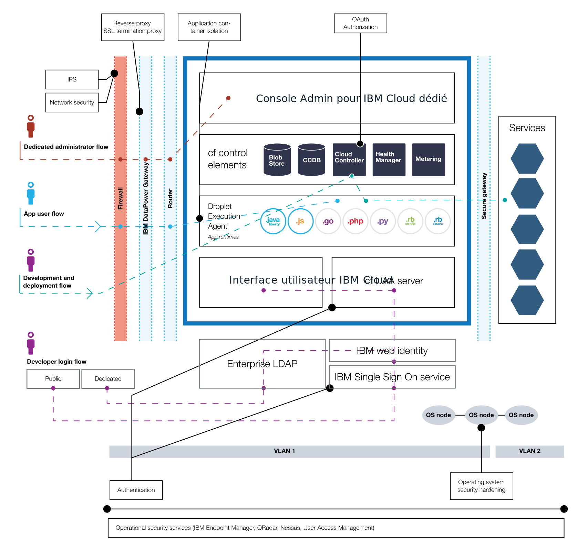

---

 

copyright:

  years: 2014, 2018

lastupdated: "2017-01-10" 

---

{:new_window: target="_blank"}
{:shortdesc: .shortdesc}

# Déploiement de la sécurité {{site.data.keyword.Bluemix_notm}}
{: #security-deployment}

L'architecture de déploiement de la sécurité {{site.data.keyword.Bluemix_notm}} inclut différents
flux d'informations pour les utilisateurs et les développeurs d'applications afin d'assurer un accès sécurisé.

Figure 3. Architecture de déploiement de la sécurité Bluemix

Pour les *utilisateurs d'application* {{site.data.keyword.Bluemix_notm}}, le **flux d'un utilisateur
d'application** est le suivant :
 1. Via un pare-feu, avec prévention contre les intrusions et sécurité du réseau.
 2. Via IBM DataPower Gateway avec proxy inverse et proxy de terminaison SSL.
 3. Via le routeur réseau.
 4. Atteint le contexte d'exécution d'application dans l'agent DEA (Droplet Execution Agent).

Le *développeur* {{site.data.keyword.Bluemix_notm}} suit les deux flux principaux : pour la connexion ainsi que pour le
développement
et le déploiement.
 * Le **flux de connexion d'un développeur** est le suivant :
    * Pour les développeurs qui se connectent à l'environnement {{site.data.keyword.Bluemix_notm}} public, le flux
est le suivant :
      1. Via le service IBM Single Sign On.
      2. Via l'identité Web IBM.
    * Pour les développeurs qui se connectent à l'environnement {{site.data.keyword.Bluemix_notm}} dédié ou local, le flux utilise le
protocole LDAP
de l'entreprise.
 * Le **flux de développement et de déploiement** est le suivant :
    1. Via un pare-feu, avec prévention contre les intrusions et sécurité du réseau. Applicable à l'environnement
{{site.data.keyword.Bluemix_notm}} dédié seulement.
    2. Via IBM DataPower Gateway avec proxy inverse et proxy de terminaison SSL.
    3. Via le routeur réseau.
    4. Via l'autorisation avec le contrôleur de cloud Cloud Foundry, pour assurer l'accès uniquement aux applications et aux instances de service qui sont
créées par le développeur.

Pour les *administrateurs* de l'environnement {{site.data.keyword.Bluemix_notm}} dédié et de l'environnement
{{site.data.keyword.Bluemix_notm}} local, le **flux d'un administrateur** est le suivant :
 1. Via un pare-feu, avec prévention contre les intrusions et sécurité du réseau.
 2. Via IBM DataPower Gateway avec proxy inverse et proxy de terminaison SSL.
 3. Via le routeur réseau.
 4. Atteint la page Administration dans l'interface utilisateur {{site.data.keyword.Bluemix_notm}}.

En plus des utilisateurs décrits dans ces scénarios, une équipe autorisée en charge des opérations de sécurité IBM effectue diverses tâches de
sécurité opérationnelles, par exemple :
 * Des analyses de vulnérabilités. Pour l'environnement {{site.data.keyword.Bluemix_notm}} local, vous êtes en charge de la sécurité
physique et des analyses au sein de votre pare-feu.
 * La gestion de l'accès utilisateur.
 * Le renforcement du système d'exploitation en appliquant des correctifs régulièrement avec IBM Endpoint Manager.
 * La gestion des risques avec protection contre les intrusions.
 * La surveillance de la sécurité avec QRadar.
 * La génération de rapports de sécurité disponibles dans la page Administration.
