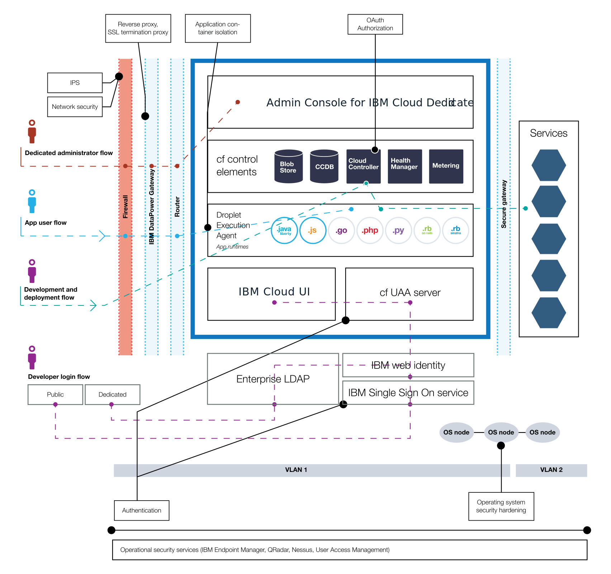

---

 

copyright:

  years: 2014, 2017

lastupdated: "2017-01-10" 

---

{:new_window: target="_blank"}
{:shortdesc: .shortdesc}

# Distribuzione della sicurezza
{{site.data.keyword.Bluemix_notm}}
{: #security-deployment}

L'architettura della distribuzione della sicurezza {{site.data.keyword.Bluemix_notm}}
include flussi di informazioni differenti per gli utenti dell'applicazione e gli sviluppatori al fine di garantire un accesso
sicuro.

Figura 3. Architettura della distribuzione della sicurezza Bluemix

Per gli *utenti dell'applicazione* {{site.data.keyword.Bluemix_notm}}, il **flusso utente applicazione** è il seguente:
 1. Tramite firewall, con il rilevamento delle intrusioni e la sicurezza di rete attivi.
 2. Tramite IBM DataPower Gateway con proxy inverso e proxy di terminazione SSL.
 3. Tramite il router di rete.
 4. Raggiunge il runtime dell'applicazione nel DEA (Droplet Execution Agent).

Lo *sviluppatore* {{site.data.keyword.Bluemix_notm}} segue due flussi principali: quello per l'accesso e quello per lo sviluppo e la distribuzione.
 * Il **flusso di accesso degli sviluppatori** include quanto segue:
    * Per gli sviluppatori che accedono a {{site.data.keyword.Bluemix_notm}} pubblico, il flusso avviene come segue:
      1. Tramite il servizio IBM Single Sign On.
      2. Tramite l'identità Web IBM.
    * Per gli sviluppatori che accedono a {{site.data.keyword.Bluemix_notm}} dedicato o locale, il flusso passa attraverso il protocollo LDAP aziendale.
 * Il **flusso di sviluppo e distribuzione** è il seguente:
    1. Tramite firewall, con il rilevamento delle intrusioni e la sicurezza di rete attivi. Ciò vale solo per {{site.data.keyword.Bluemix_notm}} dedicato.
    2. Tramite IBM DataPower Gateway con proxy inverso e proxy di terminazione SSL.
    3. Tramite il router di rete.
    4. Tramite autorizzazione utilizzando il controller Cloud Foundry, per garantire l'accesso alle sole applicazioni
e istanze del servizio create dallo sviluppatore.

Per gli *amministratori* di {{site.data.keyword.Bluemix_notm}} dedicato e {{site.data.keyword.Bluemix_notm}} locale, il **flusso amministratore** è il seguente:
 1. Tramite firewall, con il rilevamento delle intrusioni e la sicurezza di rete attivi.
 2. Tramite IBM DataPower Gateway con proxy inverso e proxy di terminazione SSL.
 3. Tramite il router di rete.
 4. Raggiunge la pagina Amministrazione nell'interfaccia utente {{site.data.keyword.Bluemix_notm}}.

Oltre agli utenti descritti in questi percorsi, un team per le operazioni di sicurezza IBM svolge diverse attività di sicurezza operativa, tra cui:
 * Scansioni delle vulnerabilità. Per {{site.data.keyword.Bluemix_notm}} locale, sono di tua competenza la sicurezza fisica e le eventuali scansioni all'interno del tuo firewall.
 * Gestione degli accessi utente.
 * Protezione avanzata del sistema operativo mediante l'applicazione periodica di correzioni con IBM Endpoint Manager.
 * Gestione dei rischi con protezione intrusioni.
 * Monitoraggio della sicurezza con QRadar.
 * Report di sicurezza disponibili sulla pagina Amministrazione.
