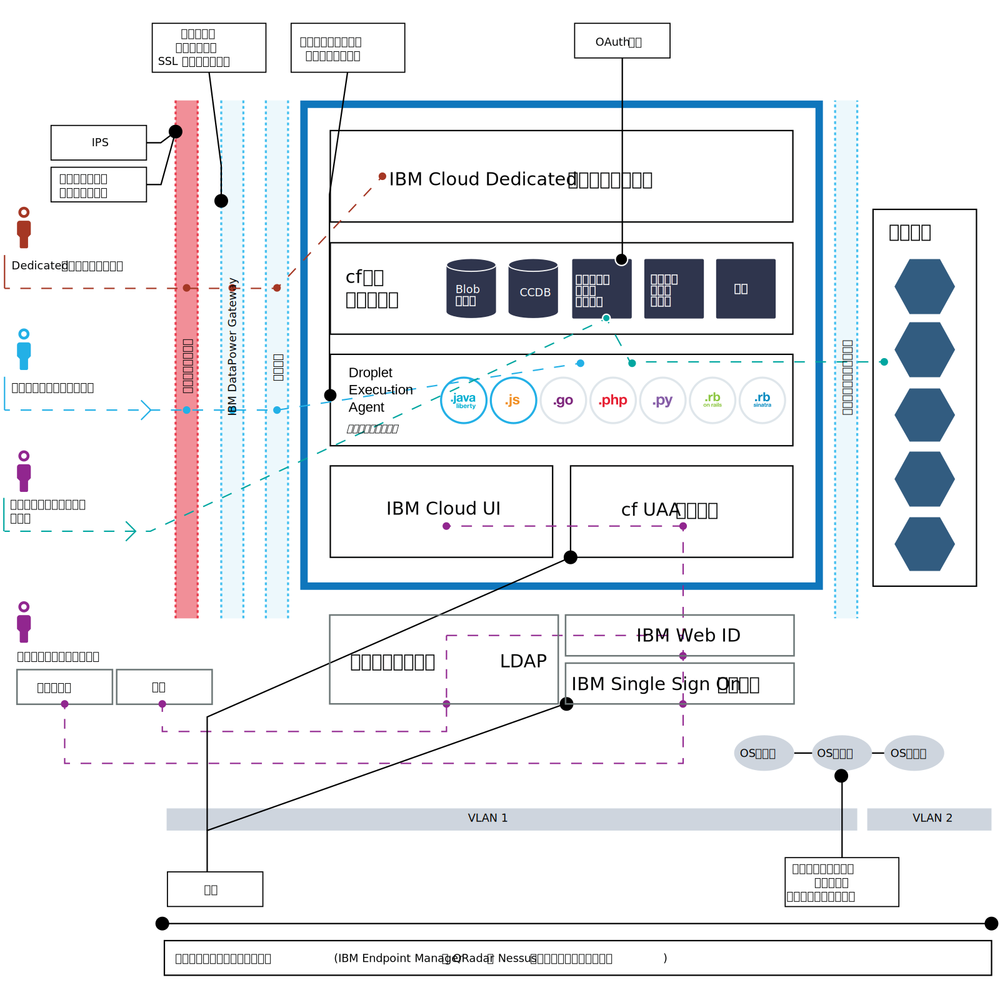

---

copyright:

  years: 2014, 2018

lastupdated: "2018-06-21" 

---

{:new_window: target="_blank"}
{:shortdesc: .shortdesc}

# {{site.data.keyword.Bluemix_notm}} セキュリティー・デプロイメント
{: #security-deployment}

{{site.data.keyword.Bluemix_notm}} セキュリティー・デプロイメント・アーキテクチャーには、セキュア・アクセスを確保するために、アプリのユーザーと開発者に対して異なる情報フローが含まれています。

図 3. IBM Cloud セキュリティー・デプロイメント・アーキテクチャー

{{site.data.keyword.Bluemix_notm}} *アプリ・ユーザー* の場合、**アプリ・ユーザーのフロー** は次のとおりです。
 1. 侵入防止およびネットワーク・セキュリティーが配備されているファイアウォールを介します。
 2. リバース・プロキシーおよび SSL 終端プロキシーを備えた IBM DataPower Gateway を介します。
 3. ネットワーク・ルーターを介します。
 4. Droplet Execution Agent (DEA) のアプリケーション・ランタイムに到達します。

{{site.data.keyword.Bluemix_notm}} *開発者* は、ログイン用と開発およびデプロイ用の 2 つのメイン・フローに従います。
 * **開発者のログイン・フロー**には、以下が含まれます。
    * {{site.data.keyword.Bluemix_notm}} Public にログインする開発者の場合、フローは以下のとおりです。
      1. IBM シングル・サインオン・サービスを介します。
      2. IBM Web ID を介します。
    * {{site.data.keyword.Bluemix_notm}} Dedicated または Local にログインする開発者の場合、フローは企業 LDAP を介します。
 * **開発およびデプロイメントのフロー**は、以下のとおりです。
    1. 侵入防止およびネットワーク・セキュリティーが配備されているファイアウォールを介し、{{site.data.keyword.Bluemix_notm}} Dedicated にのみ適用されます。
    2. リバース・プロキシーおよび SSL 終端プロキシーを備えた IBM DataPower Gateway を介します。
    3. ネットワーク・ルーターを介します。
    4. Cloud Foundry クラウド・コントローラーを使用した許可を介します。これにより、開発者によって作成されたアプリおよびサービス・インスタンスにのみアクセスが確保されます。

{{site.data.keyword.Bluemix_notm}} Dedicated および {{site.data.keyword.Bluemix_notm}} Local *管理者* の場合、**管理者のフロー**は、以下のとおりです。
 1. 侵入防止およびネットワーク・セキュリティーが配備されているファイアウォールを介します。
 2. リバース・プロキシーおよび SSL 終端プロキシーを備えた IBM DataPower Gateway を介します。
 3. ネットワーク・ルーターを介します。
 4. {{site.data.keyword.Bluemix_notm}} ユーザー・インターフェースの「管理」ページにアクセスします。

上記のパスで説明したユーザーに加え、権限がある IBM セキュリティー運用チームが、以下に示すものなど、各種運用セキュリティー・タスクを実行します。
 * 脆弱点スキャン。 {{site.data.keyword.Bluemix_notm}} Local では、お客様がファイアウォール内にある物理的セキュリティーとあらゆるスキャンを所有します。
 * ユーザー・アクセス管理。
 * IBM Endpoint Manager を使用してフィックスを定期的に適用することによる、オペレーティング・システムの堅牢化。
 * 侵入防止によるリスク管理。
 * QRadar を使用したセキュリティー・モニター。
 * 「管理」ページで入手可能なセキュリティー・レポート。
