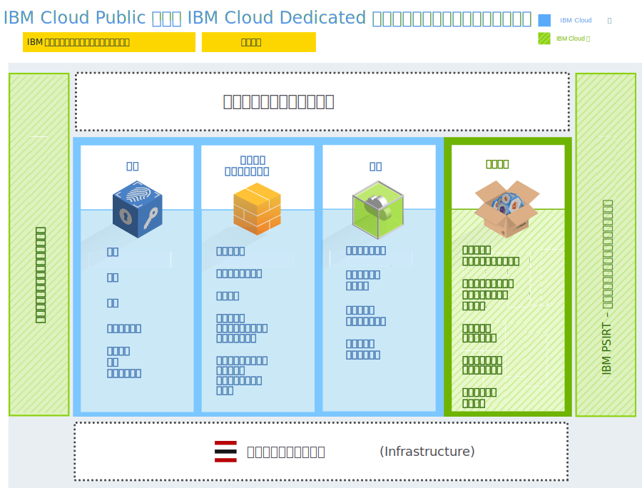

---

copyright:

  years: 2014, 2017

lastupdated: "2017-01-10"

---

{:new_window: target="_blank"}
{:shortdesc: .shortdesc}

# {{site.data.keyword.Bluemix_notm}} セキュリティー
{: #security}

{{site.data.keyword.Bluemix}} プラットフォームはセキュア・エンジニアリング・プラクティスを使用して設計されており、ネットワークおよびインフラストラクチャー全体における階層化セキュリティー管理機能を備えています。{{site.data.keyword.Bluemix_notm}} は、アプリケーション開発者がモバイル・アプリおよび Web アプリを保護するために使用できる一連のセキュリティー・サービスを備えています。これらのエレメントを組み合わせることで、{{site.data.keyword.Bluemix_notm}} は、セキュアなアプリケーション開発に対して明確な選択を提供するプラットフォームになっています。
{:shortdesc}

{{site.data.keyword.Bluemix_notm}} は、システム、ネットワーキング、およびセキュア・エンジニアリングに関する IBM のベスト・プラクティスに基づいたセキュリティー・ポリシーに準拠することで、セキュリティーが確保されている状態にします。これらのポリシーには、ソース・コード・スキャン、動的スキャン、脅威のモデル化、侵入テストなどのプラクティスが含まれます。{{site.data.keyword.Bluemix_notm}} は、セキュリティー・インシデントの管理について、IBM Product Security Incident Response Team (PSIRT) プロセスに従います。詳しくは、[IBM Security Vulnerability Management (PSIRT) ](http://www-03.ibm.com/security/secure-engineering/process.html){: new_window} のサイトを参照してください。

{{site.data.keyword.Bluemix_notm}} Public および Dedicated では、{{site.data.keyword.BluSoftlayer}} Infrastructure-as-a-Service (IaaS) クラウド・サービスを使用し、そのセキュリティー・アーキテクチャーを最大限に活用します。{{site.data.keyword.BluSoftlayer}} IaaS は、ご使用のアプリケーションとデータに対して何重にも重ねた層の保護を提供します。{{site.data.keyword.Bluemix_notm}} Local の場合、企業ファイアウォールの背後にあるお客様自身のデータ・センターに {{site.data.keyword.Bluemix_notm}} Local をホストすることで、お客様が物理的セキュリティーを所有し、インフラストラクチャーを提供します。さらに、{{site.data.keyword.Bluemix_notm}} は、Platform as a Service 層で各種カテゴリー (プラットフォーム、データ、およびアプリケーション) のセキュリティー機能を追加します。

## {{site.data.keyword.Bluemix_notm}} プラットフォームのセキュリティー
{: #platform-security}

{{site.data.keyword.Bluemix_notm}} は、({{site.data.keyword.BluSoftlayer}} を介して) コア・プラットフォームに対して機能、インフラストラクチャー、運用、および物理的なセキュリティーを提供します。ただし、{{site.data.keyword.Bluemix_notm}} Local は、お客様がインフラストラクチャーとデータ・センターを提供し、物理的セキュリティーを所有するという点で独自です。

{{site.data.keyword.BluSoftlayer}} の {{site.data.keyword.Bluemix_notm}} 環境は、ほとんどの制約的な IBM 情報技術 (IT) セキュリティー標準 (業界標準に適合しているか業界標準を上回る) に準拠しています。これらの標準には、
ネットワーク、データ暗号化、アクセス制御が含まれています。
 * アプリケーション ACL、アクセス権、侵入テスト
 * 識別、認証、許可
 * 情報とデータの保護
 * サービスの保全性と可用性
 * 脆弱性とフィックスの管理
 * サービス妨害と組織的攻撃の検出
 * セキュリティー・インシデント対応

図 1. {{site.data.keyword.Bluemix_notm}} プラットフォームのセキュリティー概要

{{site.data.keyword.Bluemix_notm}} Local では、企業ファイアウォールの背後で、データセンター内に {{site.data.keyword.Bluemix_notm}} をホストします。そのため、特定のセキュリティーの側面についてはお客様の責任となります。下図は、セキュリティーのうち、どの部分をお客様が担い、どの部分を IBM が管理、保守するかについての詳細です。

{: #localplatformsecurity}

図 2. {{site.data.keyword.Bluemix_notm}} Local プラットフォームのセキュリティー概要

IBM は、リレー ({{site.data.keyword.Bluemix_notm}} Local に付属のデリバリー機能) を使用して、お客様のデータ・センターに対して {{site.data.keyword.Bluemix_notm}} Local のインストール、リモート・モニター、および管理を行います。リレーは、各 {{site.data.keyword.Bluemix_notm}} Local インスタンスに固有の証明書にセキュアに接続します。{{site.data.keyword.Bluemix_notm}} Local およびリレーについて詳しくは、[Bluemix Local](/docs/local/index.html) を参照してください。

### 機能セキュリティー

{{site.data.keyword.Bluemix_notm}} は、ユーザー認証、アクセス許可、重要な運用の監査、およびデータ保護など、さまざまな機能セキュリティーの能力を提供します。

<dl>
<dt>認証</dt>
<dd>アプリケーション開発者は、IBM Web ID を使用することで {{site.data.keyword.Bluemix_notm}} に対して認証されます。

{{site.data.keyword.Bluemix_notm}} Dedicated および Local の場合、デフォルトで、LDAP を介した認証がサポートされます。ご要望に応じて、 {{site.data.keyword.Bluemix_notm}} に対して、代わりに IBM Web ID を介した認証をセットアップできます。
</dd>

<dt>許可</dt>
<dd>{{site.data.keyword.Bluemix_notm}} は Cloud Foundry メカニズムを使用して、確実に各アプリケーション開発者が自分の作成したアプリケーションおよびサービス・インスタンスに対してのみアクセス権限を持つようにします。{{site.data.keyword.Bluemix_notm}} サービスに対する許可は OAuth に基づいています。{{site.data.keyword.Bluemix_notm}} プラットフォームのすべての内部エンドポイントへのアクセスは、外部ユーザーに制限されています。</dd>

<dt>監査</dt>
<dd>アプリケーション開発者の認証については、成功か失敗かにかかわらずすべての試行に対して監査ログが作成されます。また、 {{site.data.keyword.Bluemix_notm}} アプリケーションが実行されるコンテナーをホストする Linux システムへの特権アクセスについても、監査ログが作成されます。</dd>

<dt>データの保護</dt>
<dd> すべての  {{site.data.keyword.Bluemix_notm}} トラフィックは、リバース・プロキシー、SSL 終了、およびロード・バランシング機能を提供する IBM WebSphere® DataPower® SOA アプライアンスを経由します。
以下の HTTP メソッドを使用できます。
<ul>
<li>DELETE</li>
<li>GET</li>
<li>HEAD</li>
<li>OPTIONS</li>
<li>POST</li>
<li>PUT</li>
<li>TRACE</li>
</ul>
HTTP の非活動タイムアウトは 2 分です。</dd>
<dd>以下のヘッダーには DataPower によりデータが取り込まれます。<dl>
<dt>$wsis</dt>
<dd>クライアント・サイドの接続がセキュア (HTTPS) である場合は true に、その他の場合は false に設定されます。</dd>
<dt>$wssc</dt>
<dd>https、http、ws、または wss のうちいずれかのクライアント接続スキームに設定されます。</dd>
<dt>$wssn</dt>
<dd>クライアントが送信するホスト名に設定されます。</dd>
<dt>$wssp</dt>
<dd>クライアントの接続先のサーバー・ポートに設定されます。</dd>
<dt>x-client-ip</dt>
<dd>クライアントの IP アドレスに設定されます。</dd>
<dt>x-forwarded-proto</dt>
<dd>https、http、ws、または wss のうちいずれかのクライアント接続スキームに設定されます。</dd>
</dl>
</dd>

<dt>セキュア開発プラクティス</dt>
<dd> {{site.data.keyword.Bluemix_notm}} Public および Dedicated では、IBM Security AppScan® Dynamic Analyzer を使用して、さまざまな {{site.data.keyword.Bluemix_notm}} コンポーネントに対してセキュリティー脆弱性スキャンを定期的に実行します。{{site.data.keyword.Bluemix_notm}} デプロイメントに対しては、そのすべてのタイプについて潜在的な脆弱性を検出して解決するために、脅威のモデル化および侵入テストを実行します。さらに、アプリケーション開発者は AppScan Dynamic Analyzer サービスを使用して、{{site.data.keyword.Bluemix_notm}} にデプロイされている自分たちの Web アプリをセキュアにすることができます。</dd>
</dl>

### インフラストラクチャーのセキュリティー

{{site.data.keyword.Bluemix_notm}} は、Cloud Foundry に基づいて、アプリケーション実行のための堅固な基盤を提供します。アーキテクチャー内で、セキュリティーおよび独立性のためにいくつかのコンポーネントが提供されます。また、整合性および可用性を確保するために、変更管理およびバックアップとリカバリーの手順を実装します。

<dl>
<dt>環境の分離</dt>
<dd> {{site.data.keyword.Bluemix_notm}} Public では、開発環境と実稼働環境を互いから分離して、アプリケーションの安定性とセキュリティーを向上させています。</dd>

<dt>ファイアウォール</dt>
<dd> ファイアウォールを配備して、{{site.data.keyword.Bluemix_notm}} ネットワークへのアクセスを制限します。{{site.data.keyword.Bluemix_notm}} Local では、企業ファイアウォールにより、{{site.data.keyword.Bluemix_notm}} インスタンスからネットワークの残りの部分を分離します。</dd>

<dt>侵入防止</dt>
<dd>{{site.data.keyword.Bluemix_notm}} Public および Dedicated では、脅威への対処を可能にするため、不正侵入に対する防御によって脅威が検出できるようになっています。侵入防止ポリシーは、ファイアウォールで有効になります。</dd>

<dt>セキュアなアプリケーション・コンテナー管理</dt>
<dd>各 {{site.data.keyword.Bluemix_notm}} アプリケーションは分離され、プロセッサー、メモリー、およびディスクに対する特定のリソース制限のある独自のコンテナー内で実行されます。</dd>

<dt>オペレーティング・システム・セキュリティーの堅牢化</dt>
<dd>IBM 管理者は IBM Endpoint Manager などのツールを使用して、定期的にネットワークおよびオペレーティング・システムの堅牢化を実行しています。</dd>
</dl>

### 運用上のセキュリティー

{{site.data.keyword.Bluemix_notm}} は、以下の制御を備えた強固な運用上のセキュリティー環境を提供します。

<dl>
<dt>脆弱点スキャン</dt>
<dd>{{site.data.keyword.Bluemix_notm}} は、Tenable Network Security の脆弱性スキャン・ツールである Nessus を使用して、ネットワークに関する問題を検出し、構成をホストして、問題が解決されるようにします。</dd>

<dt>自動化フィックス管理</dt>
<dd>{{site.data.keyword.Bluemix_notm}} 管理者は、オペレーティング・システムのフィックスが適切な頻度で確実に適用されるようにします。自動化フィックスは、IBM Endpoint Manager を使用して有効化されます。</dd>

<dt>監査ログの統合および分析</dt>
<dd>{{site.data.keyword.Bluemix_notm}} は IBMSecurity QRadar® ツールを使用して、Linux ログを統合し、Linux システムにおける特権アクセスをモニターします。また、{{site.data.keyword.Bluemix_notm}} は IBM QRadar Security Information and Event Management (SIEM) を使用して、アプリケーション開発者のログイン試行の成功および失敗をモニターします。</dd>

<dt>ユーザー・アクセス管理</dt>
<dd>{{site.data.keyword.Bluemix_notm}} 内では職務分離ガイドラインに従い、ユーザーに細かいアクセス特権を割り当てて、ユーザーが持っているのは、最小特権の原則に基づいた、ジョブの実行に必要なアクセス権限のみであることを保証します。

{{site.data.keyword.Bluemix_notm}} Dedicated および Local 環境内では、割り当てられた管理者が、管理コンソールを使用して、組織内の {{site.data.keyword.Bluemix_notm}} ユーザーの役割および許可を管理できます。詳しくは、『[{{site.data.keyword.Bluemix_notm}} の管理](/docs/admin/adminpublic.html#mng)』を参照してください。
</dd>
</dl>

### 物理的セキュリティー

{{site.data.keyword.Bluemix_notm}} Public および Dedicated は、物理的なネットワーク・セキュリティーに関し、{{site.data.keyword.BluSoftlayer}} のネットワーク内ネットワーク・トポロジーに依存しています。このネットワーク内ネットワーク・アーキテクチャーは、許可された職員のみがシステムに完全にアクセスできるようにします。{{site.data.keyword.Bluemix_notm}} Local の場合、お客様がローカル・インスタンスの物理的セキュリティーを所有します。お客様のデータ・センターは、お客様の企業ファイアウォールの背後で保護されます。

{{site.data.keyword.BluSoftlayer}} のネットワーク内ネットワークでは、パブリック・ネットワーク層 で、ホストされている Web サイトやオンライン・リソースへの公衆トラフィックを処理します。プライベート・ネットワーク層 では、SSL、PPTP、または IPSec VPN ゲートウェイを介して別個の独立したサード・パーティー通信会社を通じた真のアウト・オブ・バンド管理が可能です。データ・センターからデータ・センターへのネットワーク層 は、別々の {{site.data.keyword.BluSoftlayer}} 設備に収納されているサーバー間に、無料でセキュアな接続を提供します。

各 {{site.data.keyword.BluSoftlayer}} データ・センターは、SSAE 16 および 業界で認められた要件を例外なく満たす制御により、完全に保護されています。

## データ・セキュリティー
{: #data-security}

{{site.data.keyword.Bluemix_notm}} では、無許可アクセスからのデータの保護は、{{site.data.keyword.Bluemix_notm}} とお客様の共同作業です。

実行中のアプリケーションに関連したデータは、3 つの状態のいずれかになります (転送中のデータ、保存状態のデータ、および使用中のデータ)。

<dl>
<dt>転送中のデータ</dt>
<dd>ネットワーク上のノード間で転送されているデータ。</dd>

<dt>保存状態のデータ</dt>
<dd>保管されているデータ。</dd>

<dt>使用中のデータ</dt>
<dd>現在保管されておらず、エンドポイントで操作されているデータ。</dd>
</dl>

データ・セキュリティーについて計画する際には、それぞれのタイプのデータを考慮する必要があります。

{{site.data.keyword.Bluemix_notm}} プラットフォームは、ネットワーク全体で、データが {{site.data.keyword.Bluemix_notm}} 内部ネットワークの境界にある IBM DataPower Gateway に到達するまで、SSL を使用してアプリケーションへのエンド・ユーザー・アクセスを保護することで、転送中のデータを保護します。IBM DataPower Gateway はリバース・プロキシーとして機能し、SSL 終端を提供します。そこからアプリケーションまで、IPSEC を使用して、IBM DataPower Gateway からアプリケーションまで移動していくデータを保護します。

使用中のデータと保存状態のデータのセキュリティーはともに、アプリケーションを開発するのがお客様であるため、お客様の責任になります。{{site.data.keyword.Bluemix_notm}} カタログで使用可能ないくつかのデータ関連サービスを利用して、この問題の解決に役立てることができます。

## {{site.data.keyword.Bluemix_notm}} アプリケーションのセキュリティー
{: #application-security}

アプリケーション開発者は、{{site.data.keyword.Bluemix_notm}} で実行されるアプリケーションのために、アプリケーション・データの保護を含むセキュリティー構成を使用可能にする必要があります。

いくつかの {{site.data.keyword.Bluemix_notm}} サービスによって提供されるセキュリティー機能を使用して、アプリケーションを保護することができます。IBM によって作成されたすべての {{site.data.keyword.Bluemix_notm}} サービスは、IBM セキュア・エンジニアリング開発プラクティスに従っています。

**注:** ここで説明されているサービスの一部は、{{site.data.keyword.Bluemix_notm}} Dedicated と Local のいずれのインスタンスにも適用されない場合があります。

### SSO サービス

IBM Single Sign On for {{site.data.keyword.Bluemix_notm}} は、簡単に組み込めるシングル・サインオン機能を Node.js アプリケーションや Liberty for Java™ アプリケーションに提供する、ポリシー・ベースの認証サービスです。アプリケーション開発者がシングル・サインオン機能をアプリケーションに組み込めるようにするために、管理者はサービス・インスタンスを作成し、ID ソースを追加します。

Single Sign On サービスでは、以下に示すように、ユーザーの資格情報が保管されるいくつかの ID ソースがサポートされています。

<dl>
<dt>SAML エンタープライズ</dt>
<dd>SAML トークンを交換して認証を実行するユーザー・レジストリー。</dd>

<dt>クラウド・ディレクトリー</dt>
<dd>IBM Cloud にホストされているユーザー・レジストリー。</dd>

<dt>ソーシャル ID ソース</dt>
<dd> Google、Facebook、および LinkedIn によって保守されているユーザー・レジストリー。</dd>
</dl>

詳しくは、『[Single Sign On 概説 (Getting started with Single Sign On)](/docs/services/SingleSignOn/index.html)』を参照してください。

### Application Security on Cloud

このサービスは、モバイル・アプリおよび Web アプリのセキュリティー分析を提供します。このサービスを使用して、ソース・コードのセキュリティー脆弱性をスキャンできます。詳しくは、『[Application Security on Cloud の概要 (Getting started with Application Security on Cloud)](/docs/services/ApplicationSecurityonCloud/index.html)』を参照してください。

### アプリケーション・セキュリティー・テスト用の IBM UrbanCode プラグイン

IBM Application Security Testing for {{site.data.keyword.Bluemix_notm}} プラグインを使用すれば、{{site.data.keyword.Bluemix_notm}} でホストされている Web アプリや Android アプリに対してセキュリティー・スキャンを実行できるようになります。このプラグインは、 プラットフォームで IBM UrbanCode™ Deploy Community によって開発され、サポートされています。

詳しくは、[IBM Application Security Testing for Bluemix ](https://developer.ibm.com/urbancode/plugindoc/ibmucd/ibm-application-security-testing-bluemix/1-0/){: new_window} にアクセスしてください。

### dashDB

dashDB サービスは、ユーザー認証に組み込み LDAP サーバーを使用します。アプリケーションとデータベースの間の接続は、SSL 証明書によって保護されます。このサービスでは、DB2® 固有の暗号化機能を使用して、デプロイ済みのデータベースおよびデータベース・バックアップを自動的に暗号化します。マスター鍵のローテーションは、90 日ごとに自動で実施されます。

詳しくは、『[dashDB 概説 (Getting started with dashDB)](/docs/services/dashDB/index.html)』を参照してください。

### Secure Gateway

Secure Gateway サービスを使用すれば、{{site.data.keyword.Bluemix_notm}} アプリをオンプレミスまたはクラウドにあるリモート・ロケーションにセキュアに接続できるようになります。これにより、セキュア接続が実現し、{{site.data.keyword.Bluemix_notm}} 組織と接続先リモート・ロケーションとの間にトンネルが確立されます。{{site.data.keyword.Bluemix_notm}} ユーザー・インターフェースまたは API パッケージを使用して、セキュア・ゲートウェイを構成および作成できます。

詳しくは、『[Secure Gateway 概説 (Getting started with Secure Gateway)](/docs/services/SecureGateway/secure_gateway.html)』を参照してください。

### SIEM (Security Information and Event Management)

SIEM (Security Information and Event Management) ツールを使用して、アプリケーション・ログ内のセキュリティー・アラートを分析できます。そのようなツールの 1 つに、IBM Security QRadar&reg; SIEM があります。このツールは、クラウド環境でセキュリティー・インテリジェンスを提供します。詳しくは、[IBM QRadar Security Intelligence Platform ](http://www-01.ibm.com/support/knowledgecenter/SS42VS/welcome?lang=en){: new_window} を参照してください。
