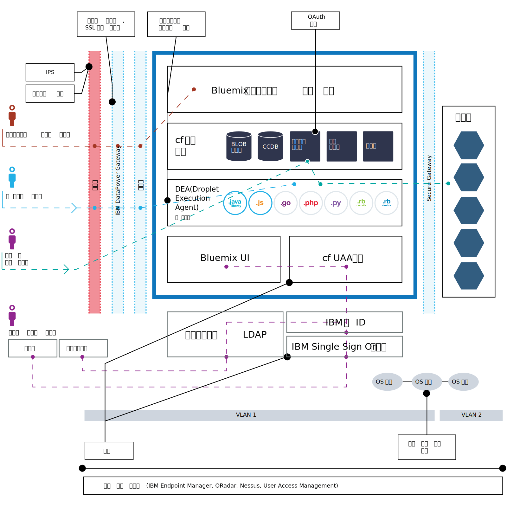

---

 

copyright:

  years: 2014, 2017

lastupdated: "2017-01-10" 

---

{:new_window: target="_blank"}
{:shortdesc: .shortdesc}

# {{site.data.keyword.Bluemix_notm}} 보안 배치
{: #security-deployment}

{{site.data.keyword.Bluemix_notm}} 보안 배치 아키텍처에는 보안 액세스를 보장할 수 있도록 앱 사용자 및 개발자용 다양한 정보 플로우가 포함되어 있습니다.

그림 3. Bluemix 보안 배치 아키텍처

{{site.data.keyword.Bluemix_notm}} *앱 사용자*의 경우, **앱 사용자 플로우**는 다음과 같습니다.
 1. 방화벽을 통해(침입 방지 및 네트워크 보안이 적절히 갖춰져 있음).
 2. IBM DataPower Gateway를 통해(리버스 프록시 및 SSL 종료 프록시 포함).
 3. 네트워크 라우터를 통해.
 4. DEA(Droplet Execution Agent)에서 애플리케이션 런타임에 도달합니다.

{{site.data.keyword.Bluemix_notm}} *개발자*는 두 개의 기본 플로우(로그인용, 개발 및 배치용)를 따릅니다. 
 * **개발자 로그인 플로우**에는 다음이 포함됩니다.
    * {{site.data.keyword.Bluemix_notm}} 퍼블릭에 로그인한 개발자의 경우 플로우는 다음과 같습니다.
      1. IBM Single Sign On 서비스를 통해.
      2. IBM 웹 ID를 통해.
    * {{site.data.keyword.Bluemix_notm}} 데디케이티드 또는 로컬에 로그인한 개발자의 경우 플로우는 엔터프라이즈 LDAP을 통합니다.
 * **개발 및 배치 플로우**는 다음과 같습니다.
    1. 방화벽을 통해(침입 방지 및 네트워크 보안이 적절히 갖춰져 있음). {{site.data.keyword.Bluemix_notm}} 데디케이티드에만 적용됩니다.
    2. IBM DataPower Gateway를 통해(리버스 프록시 및 SSL 종료 프록시 포함).
    3. 네트워크 라우터를 통해.
    4. Cloud Foundry 클라우드 제어기를 사용한 권한 부여를 통해(개발자가 작성한 앱 및 서비스 인스턴스에 대한 액세스만 보장할 수 있도록).

{{site.data.keyword.Bluemix_notm}} 데디케이티드 및 {{site.data.keyword.Bluemix_notm}} 로컬 *관리자*의 경우, **관리자 플로우**는 다음과 같습니다.
 1. 방화벽을 통해(침입 방지 및 네트워크 보안이 적절히 갖춰져 있음).
 2. IBM DataPower Gateway를 통해(리버스 프록시 및 SSL 종료 프록시 포함).
 3. 네트워크 라우터를 통해.
 4. {{site.data.keyword.Bluemix_notm}} 사용자 인터페이스에서 관리 페이지에 도달합니다.

이 경로에서 기술된 사용자와 더불어 인가된 IBM 보안 운영 팀은 다음과 같은 다양한 운영 보안 태스크를 수행합니다.
 * 취약성 스캔. {{site.data.keyword.Bluemix_notm}} 로컬에 대해 사용자는 방화벽 내 물리적 보안 및 스캔을 소유합니다.
 * 사용자 액세스 관리.
 * IBM Endpoint Manager로 수정사항을 주기적으로 적용하여 운영 체제 강화.
 * 침입 방지로 위험성 관리.
 * QRadar로 보안 모니터링.
 * 관리 페이지에서 사용 가능한 보안 보고서
