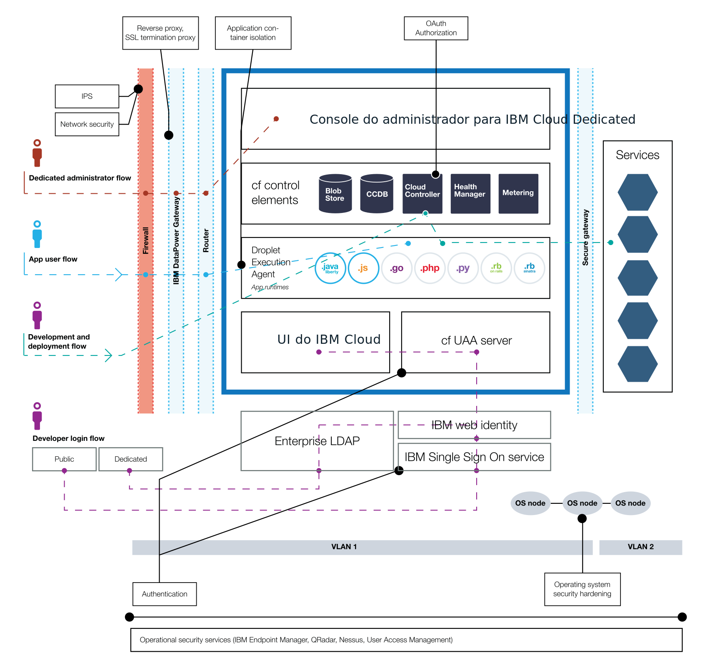

---

 

copyright:

  years: 2014, 2017

lastupdated: "2017-01-10" 

---

{:new_window: target="_blank"}
{:shortdesc: .shortdesc}

# Implementação de segurança do {{site.data.keyword.Bluemix_notm}}
{: #security-deployment}

A arquitetura de implementação de segurança do {{site.data.keyword.Bluemix_notm}} inclui diferentes fluxos de informações para usuários de app e desenvolvedores para assegurar acesso seguro.

Figura 3. Arquitetura de implementação de segurança do Bluemix

Para *usuários do app* do {{site.data.keyword.Bluemix_notm}}, o **fluxo de usuário do app** é como a seguir:
 1. Por meio de um firewall, com prevenção de intrusão e segurança de rede adequados.
 2. Por meio do IBM DataPower Gateway com proxy reverso e proxy de rescisão de SSL.
 3. Por meio do roteador de rede.
 4. Atinge o tempo de execução do aplicativo no droplet execution agent (DEA).

O *desenvolvedor* do {{site.data.keyword.Bluemix_notm}} segue dois fluxos principais: para login e para desenvolvimento e implementação.
 * O **fluxo de login do desenvolvedor** inclui os itens a seguir:
    * Para desenvolvedores que estejam efetuando login no {{site.data.keyword.Bluemix_notm}} Public, o fluxo é como a seguir:
      1. Por meio do serviço IBM Single Sign On.
      2. Por meio do IBM web identity.
    * Para desenvolvedores que estejam efetuando login no {{site.data.keyword.Bluemix_notm}} Dedicated ou Local, o fluxo é por meio do LDAP corporativo.
 * O **fluxo de desenvolvimento e implementação** é como a seguir:
    1. Por meio de um firewall, com prevenção de intrusão e segurança de rede adequados. Isso se aplica somente ao {{site.data.keyword.Bluemix_notm}} Dedicated.
    2. Por meio do IBM DataPower Gateway com proxy reverso e proxy de rescisão de SSL.
    3. Por meio do roteador de rede.
    4. Por meio de autorização, usando o controlador de nuvem Cloud Foundry para assegurar acesso somente a apps e instâncias de serviço criadas pelo desenvolvedor.

Para *administradores* do {{site.data.keyword.Bluemix_notm}} Dedicated e do {{site.data.keyword.Bluemix_notm}} Local, o **fluxo do administrador** é como a seguir:
 1. Por meio de um firewall, com prevenção de intrusão e segurança de rede adequados.
 2. Por meio do IBM DataPower Gateway com proxy reverso e proxy de rescisão de SSL.
 3. Por meio do roteador de rede.
 4. Atinge a página Administração na interface com o usuário do {{site.data.keyword.Bluemix_notm}}.

Além dos usuários descritos nesses caminhos, uma equipe de operações de segurança autorizada da IBM executa várias tarefas de segurança operacionais, como as descritas a seguir:
 * Varreduras de vulnerabilidade. Para {{site.data.keyword.Bluemix_notm}} Local, você possui a segurança física e quaisquer varreduras dentro do firewall.
 * Gerenciamento de acesso do usuário.
 * Reforço do sistema operacional pela aplicação periódica de correções com o IBM Endpoint Manager.
 * Gerenciamento de riscos com proteção contra intrusão.
 * Monitoramento de segurança com QRadar.
 * Relatórios de segurança disponíveis na página Administração.
