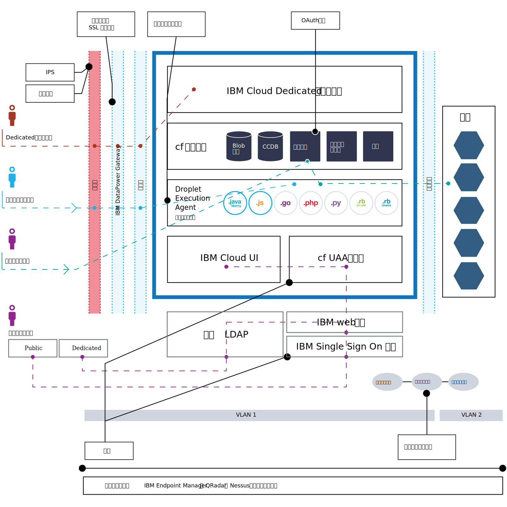

---

 

copyright:

  years: 2014, 2018

lastupdated: "2018-04-11" 

---

{:new_window: target="_blank"}
{:shortdesc: .shortdesc}

# {{site.data.keyword.Bluemix_notm}} 安全部署
{: #security-deployment}

{{site.data.keyword.Bluemix_notm}} 安全部署体系结构包含适用于应用程序用户和开发者的不同信息流，可确保访问安全。

图 3. IBM Cloud 安全部署体系结构

对于 {{site.data.keyword.Bluemix_notm}} *应用程序用户*，**应用程序用户流**如下所示：
 1. 经过具有适当入侵防御功能和网络安全的防火墙。
 2. 经过具有逆向代理和 SSL 终止代理功能的 IBM DataPower Gateway。
 3. 经过网络路由器。
 4. 到达 Droplet Execution Agent (DEA) 中的应用程序运行时。

{{site.data.keyword.Bluemix_notm}} *开发者*遵循两个主要流：一个用于登录，一个用于开发和部署。
 * **开发者登录流**包含以下内容：
    * 对于要登录到 {{site.data.keyword.Bluemix_notm}} Public 的开发者，信息流如下所示：
      1. 经过 IBM Single Sign On 服务。
      2. 经过 IBM Web 身份。
    * 对于要登录到 {{site.data.keyword.Bluemix_notm}} Dedicated 或 Local 的开发者，信息流将经过企业 LDAP。
 * **开发和部署流**如下所示：
    1. 经过具有适当入侵防御功能和网络安全的防火墙，并仅应用于 {{site.data.keyword.Bluemix_notm}} Dedicated。
    2. 经过具有逆向代理和 SSL 终止代理功能的 IBM DataPower Gateway。
    3. 经过网络路由器。
    4. 经过授权（通过使用 Cloud Foundry 云控制器），以确保仅访问开发者创建的应用程序和服务实例。

对于 {{site.data.keyword.Bluemix_notm}} Dedicated 和 {{site.data.keyword.Bluemix_notm}} Local *管理员*，**管理员流**如下所示：
 1. 经过具有适当入侵防御功能和网络安全的防火墙。
 2. 经过具有逆向代理和 SSL 终止代理功能的 IBM DataPower Gateway。
 3. 经过网络路由器。
 4. 在 {{site.data.keyword.Bluemix_notm}} 用户界面中访问“管理”页面。

除了这些方法中描述的用户，还有经过授权的 IBM 安全操作团队会执行各种操作安全任务，例如：
 * 漏洞扫描。对于 {{site.data.keyword.Bluemix_notm}} Local，您拥有防火墙内的物理安全和任何扫描。
 * 用户访问权管理。
 * 通过使用 IBM Endpoint Manager 定期应用修订，加强操作系统安全。
 * 通过入侵防御来管理风险。
 * 使用 QRadar 监视安全。
 * 在“管理”页面上提供有安全报告。
